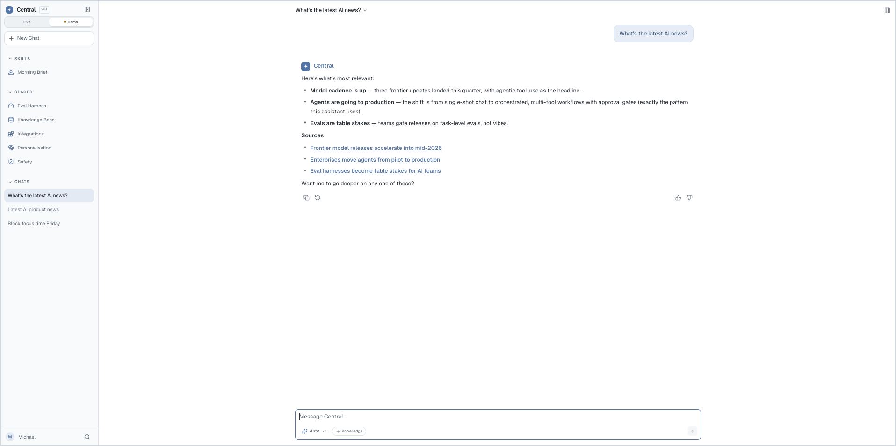
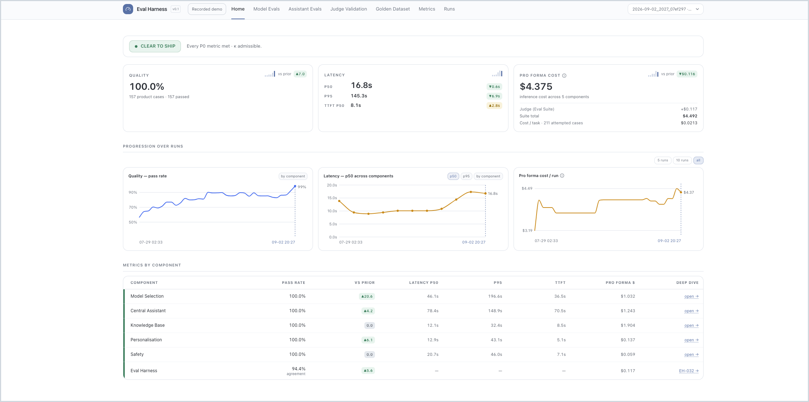

# AI Product Manager Portfolio
## Overview:
<table width="100%">
  <thead>
  <tr>
    <th width="24%">Project</th>
    <th width="48%">Problem and Solution</th>
    <th width="28%">Built With</th>
  </tr>
  </thead>
  <tbody>
  <tr>
    <td width="24%" valign="top"><b><a href="central/README.md">Central</a></b> Personal AI assistant harness for knowledge work   </td>
    <td width="48%" valign="top"><b>Problem:</b> Paid AI plans cap usage, and knowledge work is scattered across email, calendar, documents and the web.  <b>Solution:</b> One agentic assistant at &#36;0 inference cost that:<ul><li>works across 37 tools</li><li>shows what it will do first</li><li>remembers the user in a readable profile</li><li>blocks harmful requests without over-refusing</li><li>keeps working when a provider fails</li></ul></td>
    <td width="28%" valign="top">      </td>
  </tr>
  </tbody>
  <tbody>
  <tr>
    <td width="24%" valign="top"><b><a href="eval_harness/README.md">Eval Harness</a></b> Offline evals and release gate for Central   </td>
    <td width="48%" valign="top"><b>Problem:</b> Any change can break an agent, and small teams often ship after spot-checks because agent evals are hard to build.  <b>Solution:</b> A working example of agent evals on a real product that:<ul><li>scores Central's outputs against 211 golden cases</li><li>trusts the judge only once it matches human labels</li><li>gives one release verdict</li></ul></td>
    <td width="28%" valign="top">     </td>
  </tr>
  </tbody>
</table>

## Demo Preview:
**[Central](https://michaelma-central.vercel.app/)**

**[Eval Harness](https://michaelma-eval-harness.vercel.app/)**

## Connect
  
