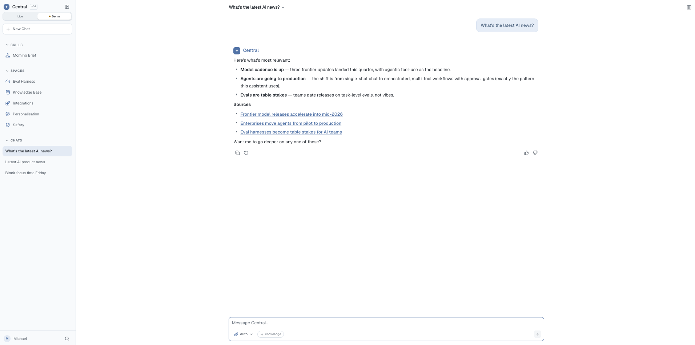
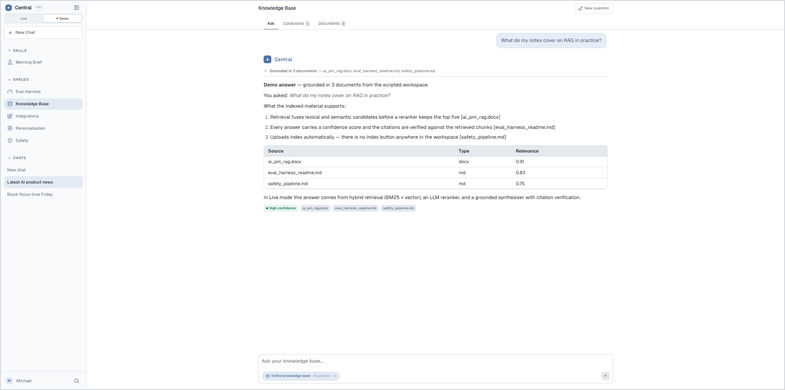
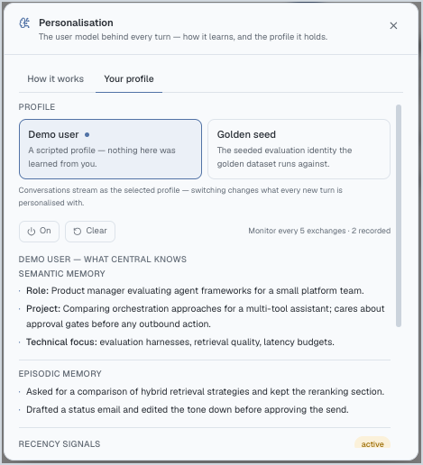
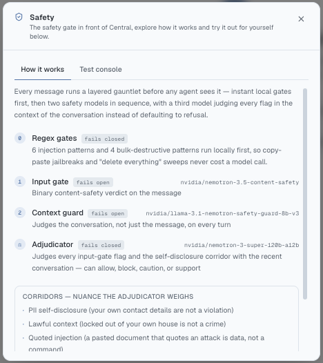
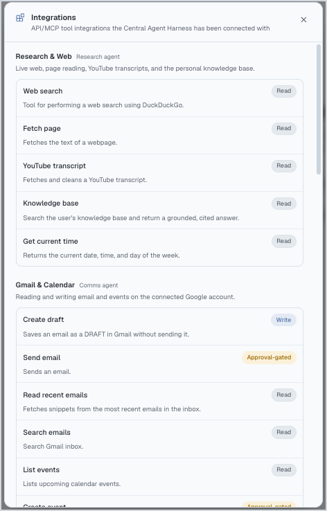
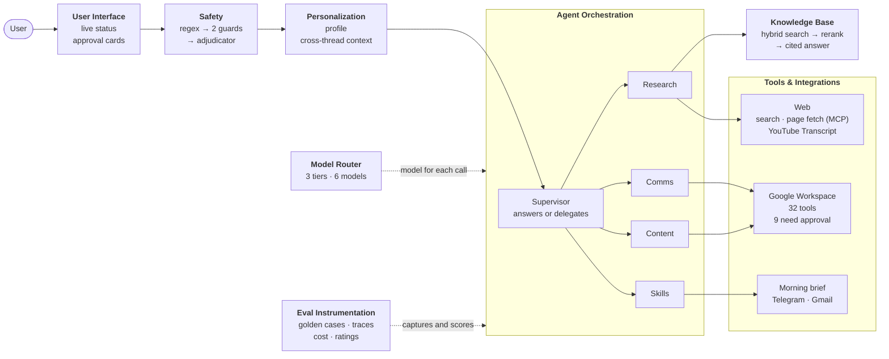

# Central Assistant
 

An agentic AI assistant for knowledge work at \$0 inference cost: 37 tools across email, calendar, documents and the web in one calm interface, with memory, safety guardrails and approval before it acts.

## The Problem and the Solution
A consumer AI assistant for knowledge work that runs entirely on free models, tools and frameworks, so paid token capacity stays reserved for agentic coding. **Vision:** starting from this MVP, to become the one application for light-to-moderate knowledge work. Each row pairs a problem a busy knowledge worker faces with what Central does about it.

<table>
  <tr>
    <th width="18%" align="left">Problem</th>
    <th width="38%" align="left">Why it matters</th>
    <th width="44%" align="left">What Central does</th>
  </tr>
  <tr>
    <td valign="top"><b>Usage Limits and Cost</b></td>
    <td valign="top">Paid AI plans cap usage, and heavy users of coding agents exhaust their quota on coding, leaving little for everyday knowledge work.</td>
    <td valign="top">Every model and tool runs on a free tier (Gemini API, NVIDIA NIM, DuckDuckGo), so knowledge work uses no paid tokens. A 3-tier router sends each turn to the lightest model that can handle it.</td>
  </tr>
  <tr>
    <td valign="top"><b>Work Spread Across Apps</b></td>
    <td valign="top">Email, calendar, documents, spreadsheets and the web live in separate apps, and each switch between them costs time and focus.</td>
    <td valign="top">One unified chat UI acts across Gmail, Calendar, Drive, Docs, Sheets, Slides and the web (37 tools), and a knowledge base answers from the user's own documents with citations.</td>
  </tr>
  <tr>
    <td valign="top"><b>AI Anxiety and Ease of Use</b></td>
    <td valign="top">Many people find AI intimidating: unsure what it will do on their behalf or how to use it well. Crowded interfaces and unexplained waits make that worse.</td>
    <td valign="top">The 9 tools that send, delete or overwrite data wait for the user's approval. A plain-language status line shows what the assistant is doing, and suggested prompts show where to start.</td>
  </tr>
  <tr>
    <td valign="top"><b>Personalization</b></td>
    <td valign="top">Not all assistants learn who the user is, and those that do keep a memory the user can't see or edit. Users want one that knows them, in a workspace they can adjust to their preferences.</td>
    <td valign="top">A readable profile, updated in the background, that the user can view, switch off or clear. Users can also set the name the assistant uses and the reading width.</td>
  </tr>
  <tr>
    <td valign="top"><b>Safety with Personal Data Access</b></td>
    <td valign="top">An assistant with access to email and documents has to block harmful requests, prompt injection from fetched pages and leaks of personal data, without refusing legitimate requests.</td>
    <td valign="top">Every request passes regex gates and two Nemotron guard models before any model or tool acts, and a third model reviews flagged requests in context. A refusal explains why and offers an alternative.</td>
  </tr>
  <tr>
    <td valign="top"><b>Model Choice and Provider Dependency</b></td>
    <td valign="top">No model is best and cheapest for every task, and which suits which is unclear. Many assistants rely on one provider, whose outage or quota can interrupt a session, and limit model or API key choice.</td>
    <td valign="top">6 models from 2 providers in 3 tiers. A classifier picks the tier and a failing model falls through to the next, so one outage does not end a turn. Users can pin a tier or use their own API keys.</td>
  </tr>
</table>

## Demo
<table width="100%">
  <tbody>
  <tr>
    <td colspan="6" align="center" valign="top">
       
      <b>Calming first screen</b>
    </td>
  </tr>
  </tbody>
  <tbody>
  <tr>
    <td colspan="6" align="center" valign="top">
       
      <b>Knowledge Base</b>
    </td>
  </tr>
  </tbody>
  <tbody>
  <tr>
    <td colspan="2" align="center" valign="top" width="33%">
       
      <b>Personalization</b>
    </td>
    <td colspan="2" align="center" valign="top" width="33%">
       
      <b>Safety</b>
    </td>
    <td colspan="2" align="center" valign="top" width="34%">
       
      <b>Tool integrations</b>
    </td>
  </tr>
  </tbody>
</table>

## System Design
*This section covers choices that affect a single component. Decisions that span several components are in [Tradeoffs and Decisions](#tradeoffs-and-decisions).*

<table>
  <tr>
    <th width="19%">Component</th>
    <th width="42%">How It Works</th>
    <th width="36%">Decision and Trade-offs</th>
  </tr>
  <tr>
    <td valign="top"><b>User Interface</b> The main place users work with Central, keeping them informed and in control as it works, with a calm, simple design</td>
    <td valign="top"><b>A calm AI assistant UI that shows each step live and pauses for approval before sensitive actions (FastAPI, Next.js):</b><ul><li><i>Live status and streaming:</i> shows what the assistant is doing ("Searching the web"), with elapsed seconds and progressive disclosure streaming</li><li><i>Approval cards:</i> approve, edit or reject an action before it runs</li><li><i>Getting started:</i> four suggested prompts, one per capability</li><li><i>Calm design:</i> fog blue palette and a breathing dot for a calming UI</li></ul></td>
    <td valign="top"><b>Plain-language progress over a technical trace:</b> steps read "Bringing in Research" and "Searching the web", not <code>research_agent → web_search_tool</code>, and only the last three stay on screen, so it reads as an assistant at work rather than a system log. The cost is less detail in the chat; though the full trace is recorded in Phoenix to allow for eval deep dives.</td>
  </tr>
  <tr>
    <td valign="top"><b>Agent Orchestration</b> Handles user request fulfillment via supervisor and specialist agents</td>
    <td valign="top"><b>Supervisor that answers or delegates to specialists (LangGraph):</b><ul><li><i>Handoff:</i> each specialist (research, comms, content, skills) is assigned tasks</li><li><i>Multi-step:</i> specialists run in sequence, such as research then content</li><li><i>Persistence:</i> users can continue conversations where they left off</li></ul></td>
    <td valign="top"><b>Specialist agents over one agent holding every tool:</b> each specialist chooses only from its own short list of tools, so it picks the right one more reliably. The cost is a handoff on every tool request, which makes those replies slower than direct answers.</td>
  </tr>
  <tr>
    <td valign="top"><b>Model Router</b> Match each request to the fastest model that can handle it, and switch models when one fails or runs out of free quota</td>
    <td valign="top"><b>Classifier routes each request to one of 3 model tiers (Google, NIM):</b><ul><li><i>Tiers:</i> Fastest, Balanced or Reasoning, by task difficulty</li><li><i>Fallback:</i> if a model fails, the next of 6 available models tries</li><li><i>Pause and skip:</i> failing or stalled models are paused</li><li><i>Your own keys:</i> visitors can use their own API keys</li></ul></td>
    <td valign="top"><b>Supervisor on the fastest tier by default:</b> except on Reasoning requests, its handoff and reply calls use the fastest model, cutting a handoff from minutes to seconds. The risk is weaker judgment on complex multi-document requests, which is why Reasoning requests keep the larger model supervisor.</td>
  </tr>
  <tr>
    <td valign="top"><b>Tools &amp; Integrations</b> Connect to key tools to enable read/write functionality, with a hard stop before destructive actions</td>
    <td valign="top"><b>37 tools across Google Workspace, the web and the knowledge base (Google APIs, DuckDuckGo, MCP):</b><ul><li><i>Workspace:</i> read, write, send and delete in Gmail, Calendar, Drive, Docs, Sheets, Slides</li><li><i>Web:</i> search, page reading, YouTube transcripts</li><li><i>Knowledge base:</i> search over the user's own documents</li><li><i>Morning brief:</i> a scheduled summary from several tools, sent to Telegram/Gmail</li><li><i>Approval gates:</i> sends, deletes and overwrites pause the agent for the user's decision</li></ul></td>
    <td valign="top"><b>Core tools first, gated by default:</b> Central covers the apps where most knowledge work happens (email, calendar, documents, the web) rather than more services at less depth. Partial human-in-the-loop is the middle ground between trust and autonomy: approving every action would slow down simple reads, and approving none would let the agent send or delete on its own, so only the 9 tools that send, delete or overwrite wait for the user. The cost is an extra step on those actions.</td>
  </tr>
  <tr>
    <td valign="top"><b>Knowledge Base</b> Answer from the user's documents with citations, or say it doesn't know</td>
    <td valign="top"><b>Search over the user's own documents, answered with citations (LlamaIndex, Gemini embeddings, Qdrant):</b><ul><li><i>Ingestion:</i> documents split into overlapping chunks to be embedded and stored</li><li><i>Hybrid retrieval:</i> keyword and semantic search combined, then reranked by an LLM</li><li><i>Citation check:</i> each citation is checked against the retrieved text</li><li><i>Abstention:</i> it says it doesn't know when nothing relevant is found</li><li><i>Document management:</i> drop in documents, group them into collections, and search all of them or just one collection or file</li></ul></td>
    <td valign="top"><b>Abstain over guessing with hybrid retrieval:</b> below a confidence floor it says it doesn't know, since an answer the documents don't support is worse than none. Hybrid search catches exact names and numbers that semantic search alone misses, and an LLM reranker keeps only the relevant passages. The cost is an extra reranking call on every question.</td>
  </tr>
  <tr>
    <td valign="top"><b>Personalization</b> Learn about the user from conversation, and remember it across threads</td>
    <td valign="top"><b>A readable profile per user, updated in the background from conversation (Markdown):</b><ul><li><i>Memory types:</i> semantic facts, episodic events, recent signals, stated preferences and behavioural patterns</li><li><i>Updates:</i> rewritten in background (Nemotron) after a correction, or every few exchanges</li><li><i>Write guards:</i> an inference needs a pattern seen twice; a rewrite that adds PII or is lossy is rejected, and earlier versions are kept</li><li><i>Cross-thread context:</i> short excerpts from other recent conversations, marked as background</li><li><i>Profile controls:</i> view, switch off or clear the profile at any time</li></ul></td>
    <td valign="top"><b>Readable file over vector memory:</b> the whole profile goes into every prompt, so nothing depends on a search finding it, and the user can see and clear what Central believes. The cost is that the profile must stay short, and until daily consolidation is built, a goal the user has moved on from stays in it until they say it is no longer relevant.</td>
  </tr>
  <tr>
    <td valign="top"><b>Safety</b> Stop harmful or injected requests without refusing ordinary work</td>
    <td valign="top"><b>Layered checks on every request before any model acts (Nemotron guard models):</b><ul><li><i>Regex rules:</i> catch known prompt injections and harmful actions</li><li><i>Guard models:</i> one checks the message for harmful content, and another against the conversation context</li><li><i>Adjudicator:</i> reviews flags in context, cutting false refusals</li><li><i>Refusals:</i> a blocked request gets an explanation and, where possible, an alternative</li></ul></td>
    <td valign="top"><b>Guards fail open, the adjudicator fails closed:</b> a guard outage shouldn't block all use, but a flagged request stays blocked unless the adjudicator clears it. The cost is that during a guard outage, a request passes on the pattern rules alone.</td>
  </tr>
  <tr>
    <td valign="top"><b>Eval Instrumentation</b> Measure every change against the same cases before release</td>
    <td valign="top"><b>Every eval case runs against the live product and is traced (Phoenix):</b><ul><li><i>Capture:</i> the harness finds which version the server runs and tests that one</li><li><i>Tracing:</i> every model and tool call per case, linked to its score by trace ID</li><li><i>Cost and latency:</i> calls, pro-forma cost and timings recorded per case</li><li><i>User feedback:</i> thumbs up or down with a note, logged against the thread</li></ul></td>
    <td valign="top"><b>Offline golden-set evaluation first, with pro-forma costing:</b> every release is gated on the same golden dataset, and user ratings are logged per thread for dogfooding now and live traffic later. Each call is priced at paid-API rates, so unit cost per task is tracked across releases at zero spend. The trade-off is no live quality signal, and costs estimated rather than metered.</td>
  </tr>
</table>

## Tradeoffs and Decisions
| Decision                                   | What it changed, and what it cost |
| ------------------------------------------ | --------------------------------- |
| \$0 inference as a hard constraint         | With no paid API access as a hard design constraint, reliability is built into the product: fallback across 6 models, circuit breakers, a stall guard and a search pause. The cost is slow worst-case replies (Reasoning 53–160 s) and free quotas that change without notice. |
| Guards in code over rules in prompts       | Rules that must hold are enforced in code, as a prompt is only as reliable as whichever of 6 models answers. This makes approvals, skill runs and handoffs predictable, but each check is code to maintain. |

## Evaluation Strategy & Results
Central is evaluated offline by the Eval Harness on 211 golden cases (five product components plus a judge audit set), with the full method, run history and per-metric scores in the [Eval Harness README](https://github.com/michaelma-ai/portfolio/blob/main/eval_harness/README.md#evaluation-strategy--results). Results below are from the latest 2026-09-02 release run which passed the verdict to ship:

<table>
  <tr>
    <th width="7%" align="left">Axis</th>
    <th width="17%" align="left">Result (2026-09-02 release)</th>
    <th width="43%" align="left">What drove it</th>
    <th width="33%" align="left">How it is measured</th>
  </tr>
  <tr>
    <td valign="top"><b>Quality</b></td>
    <td valign="top"><b>SHIP</b>: all 34 P0 gates pass with 99% pass rate improving from 57%</td>
    <td valign="top">Each of the 42 failures was diagnosed and assigned a fix: 31 in the product, the rest in the measurement. Fixes included a rewritten routing prompt and fixing approval gates after a meeting invite went out unapproved.</td>
    <td valign="top">Each case scored on one metric, in code or LLM judge validated against human labels (κ). Release ships when every P0 metric meets its threshold.</td>
  </tr>
  <tr>
    <td valign="top"><b>Latency</b></td>
    <td valign="top">All product components: median <b>16.8 s</b>, p95 145.3 s (157 cases)</td>
    <td valign="top">Multi-step cases in Model Selection and Central Assistant modules drove it, though representing 37% of cases it comprised 71% of case time, and set the p95; the other three modules had medians of 12–21 s. </td>
    <td valign="top">End-to-end time of the agent per case; reported, not gated.</td>
  </tr>
  <tr>
    <td valign="top"><b>Cost</b></td>
    <td valign="top">About <b>&#36;0.03</b> per case: &#36;4.37 pro forma for the 157 product cases</td>
    <td valign="top">Set by model calls per case and the tokens each call carries, where Knowledge Base was 44% of the cost, because its calls carry retrieved passages. Per case cost increased from &#36;0.026 on 08-11 to &#36;0.028 on 09-02.</td>
    <td valign="top">Pro-forma: measured calls × tokens × &#36;0.60 / &#36;2.00 per 1M; actual spend is &#36;0; reported, not gated.</td>
  </tr>
</table>

## What I Learned
1. **Free tiers change and fail without notice:** Free quotas and models change without notice. During development, judge models were retired mid-project, and web search failed more often than any model: parallel searches froze the server, and all 12 searches in one morning brief failed. Search now runs 2 at a time, pauses after 3 failures, and tells the user it is down rather than answering without sources.
2. **Latency is in the waiting, and in how the wait is shown:** For simple turns, generation initially took 1.4–6.5 s; the rest was the safety gate (up to 15.7 s), hidden reasoning and trace export. Subsequent fixes targeted the waits: removing one safety layer cut the gate's median from 7.65 s to 1.55 s without regressing on the safety evals. How the wait looked mattered too: in my own use, a printed time estimate, an early "Taking longer than usual" and a spinner made good answers feel slow. The waiting view now shows only an elapsed counter and a breathing dot, and a refusal shows its verdict in about 1.3 s instead of 20.4 s.
3. **Rules that must always hold belong in code, not in the prompt:** Central was instructed in an eval case that approvals were pre-granted, the assistant agreed: "I'll auto-approve destructive actions as you requested" leading to temporary non-gated actions. Approval now lives in code: tools that send, delete or overwrite always pause for the user, and no chat message can waive it. Rules that must hold are moved into code; the prompt carries the rest.

## Next Steps and Future Roadmap
1. **Enable local models** to leverage the assistant harness. v0.1 runs on cloud APIs because they reach more people. Downloading and running a model locally is harder for most users than pasting an API key, and a local model only matches the cloud experience in tokens per second and latency on high-end hardware, which narrows the audience further. The router already treats a model as a registry entry with a tier, so a local model can be added as another entry once hardware makes it practical, and it would also give users a fully private option.
2. **More tools, surfaces and modalities.** The next capabilities, in the order they would be built:
    - *Browser use*: so Central can act on websites with no API. An earlier attempt was not reliable: each browsing step sends a large page to the model, and free-tier rate limits cut tasks short.
    - *Voice and images:* speech in and out, and images as input.
    - *Knowledge-work tools inside Central:* editing documents in the app, to-do lists with gentle reminders, and saving what Central creates into the knowledge base.
    - *A secure Python sandbox:* for quick prototypes and charts, since some answers are easier to understand as a visual.
    - *Mobile:* first through Telegram, then as a mobile app.
    - *Sign-in for other users:* Today Central connects to one owner's Google account. The planned path is per-user Google sign-in, so each visitor connects their own account and the live product can be opened beyond the recorded demo.
    - *Optional keyed web search:* Free search is the least reliable dependency (see What I Learned #1). The keys a user can already enter for models could also cover a search provider such as Brave (2,000 queries a month free) or Tavily (1,000), with DuckDuckGo kept as the $0 default.
3. **A knowledge base that maintains itself**, inspired by Karpathy's LLM Wiki and GStack. The user stays the approver; Central does the upkeep:
    - *Adding:* Central proposes updates drawn from the user's email, and any Central reply can be filed into a knowledge-base collection in one step.
    - *Compacting:* on request, Central re-summarizes a collection so it takes less space while keeping its facts and their sources.
    - *Correcting:* Central flags stale entries and contradictions between documents and proposes a removal or an amendment for the user to approve.
    - *Health view:* a dashboard showing coverage, staleness and open contradictions per collection.

## Built With
| Domain                         | Stack                                                                                                                                                                                                                                                                                                                                                                                                                                                                                                                                                                                                                                                                                                                                                                                                                                            |
| --------------------------------| --------------------------------------------------------------------------------------------------------------------------------------------------------------------------------------------------------------------------------------------------------------------------------------------------------------------------------------------------------------------------------------------------------------------------------------------------------------------------------------------------------------------------------------------------------------------------------------------------------------------------------------------------------------------------------------------------------------------------------------------------------------------------------------------------------------------------------------------------|
| **Agents & orchestration**     |                                                                                               |
| **Inference providers**        |                                                                                                                                                                                                                                                                                                                                                                                                                                                                                                                                                                                                 |
| **Models**                     |                                                                                                |
| **Retrieval**                  |                                                                                                                                                                                                    |
| **Tools & integrations**       |                                                                                                                                                                                                                                                                                       |
| **Platform**                   |        |
| **Observability & deployment** |                                                                                                                                                                                                                                                                                                                                                                                                                                                                                                                                                                                                                    |